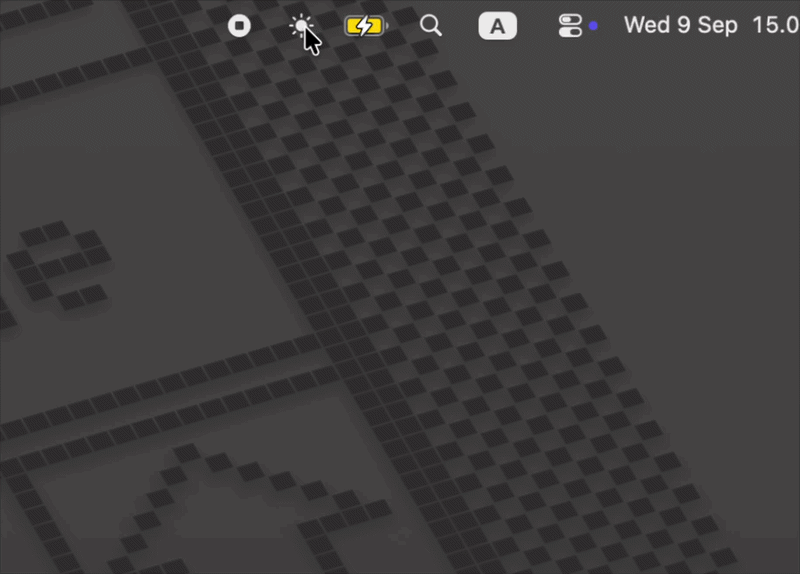

# BrightnessBar

A simple menu bar app to control monitor brightness on macOS. Apple Silicon only.



## Features

- Internal (built-in) display brightness control
- External display brightness control via DDC/CI
- Automatic monitor name detection (e.g. "DELL P2722H")
- Lightweight, lives in the menu bar with no persistent window

## Requirements

- macOS 12+ Apple Silicon (M1/M2/M3)
- Xcode Command Line Tools (`xcode-select --install`)

## Build & Run

```bash
cd BrightnessBar
bash build.sh
open build/BrightnessBar.app
```

## Technical Notes

DDC/CI is sent via `IOAVServiceWriteI2C` (CoreDisplay private API).

- Chip address `0xB7` for HDMI (MCDP29XX bridge on M1 Pro/Max)
- Chip address `0x37` for DisplayPort / USB-C
- Slider writes are debounced 300ms to avoid flooding the monitor MCU
- Internal display uses `DisplayServicesSetBrightness` (DisplayServices private API)
- DELL P2722H does not support DDC reads, so brightness state is kept in-memory

## Structure

```
AppDelegate.swift              menu bar status item and popover
BrightnessViewController.swift UI sliders for internal and external displays
BrightnessController.swift     DDC and DisplayServices logic
IOAVService.h / .c             C shim for the private IOAVService API
build.sh                       build script (swiftc + clang, no Xcode project)
```
